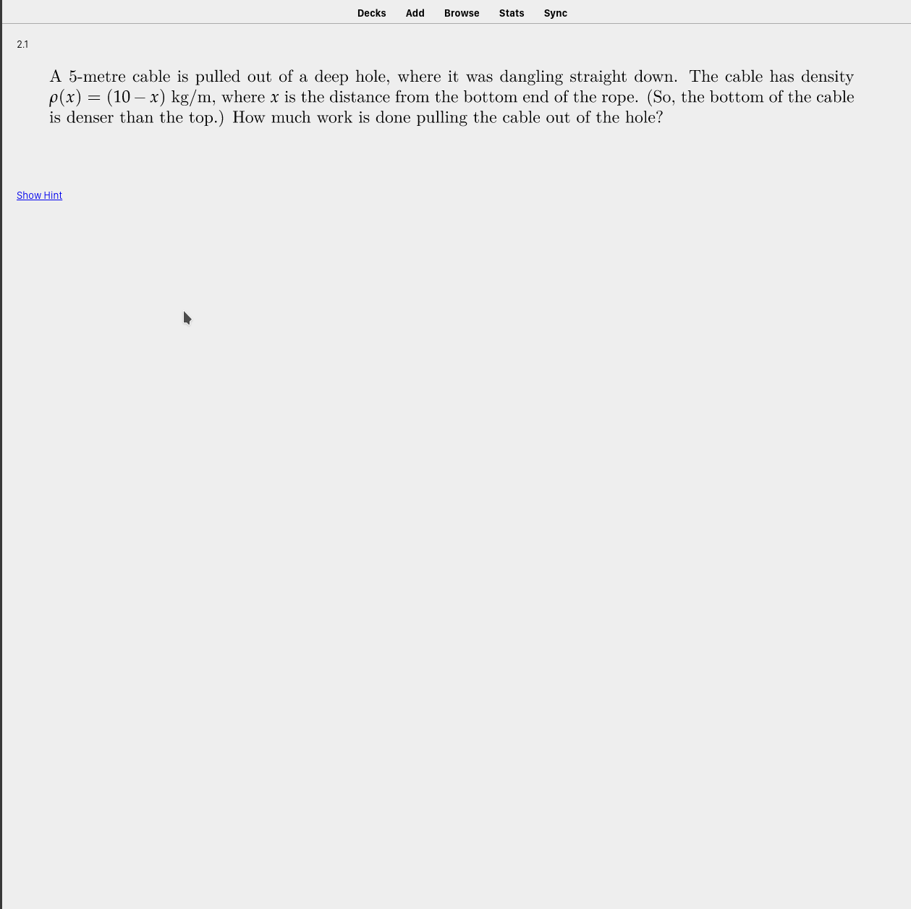

# Anki CLP

This is a tool I built in January 2020 to improve my efficiency when studying for math courses. It parses the questions from any UBC CLP textbook to generate [Anki](https://en.wikipedia.org/wiki/Anki_(software)) flashcards. It then makes use of the Anki spaced repetition algorithm to intelligently present you with practice questions based on your prior performance. 

Admittedly, there's a lot of trickery that goes into making this work and consequently setting it up may be challenging. However, this script has dramatically improved my test scores while reducing the amount of time that I spend studying.



## Usage

1. Download the [source files](http://www.math.ubc.ca/~CLP/src/) for your CLP of choice.
2. Run `pip install genanki pandas`
2. Run `python ./genclp.py <target files>` where `<target-files>` corresponds to the problem book .tex files of choice.

For example, if you .tex files are in the `problem-files/` directory, run
`python ./genclp.py -v -r problems/*`to generate an Anki deck from *only* the representative questions (those marked in blue).

3. Options: 
    - '-r' generate only cards for representative questions.
    - '-v' verbose output (recommended).
    - '-c' generate a .csv file instead of an Anki deck (requires a filename).

3. Import the `clp-output.apkg` file into Anki.
4. In Anki under `Tools -> Manage Note Types -> CLP Question -> Options` select `Create scalable images with dvisvgm`.

## Features

- Automatically tags cards by section, allowing you to suspend sections until you've reached them in your course.
- Support questions, hints, answers, and solutions.

### Known bugs
- References do not work and will show up as **??** in cards. Unfortunately, there is nothing that can be done about this.
- A small number of cards that import external images and will fail to build. This is being worked on.

## Installation

Unfortunately, it is rather... complex to run this script since much massaging must be performed to get Anki to cooperate. This should be everything that's needed to get this set up on Linux, but if you encounter any difficulties feel free to submit an issue or contact me at [my website](https://www.alexkoen.com).

### Install the macros

For security reasons, Anki does not allow new commands to be defined in headers. For this reason, we must install a custom package.

Copy `clpmacros.sty` to your TeX directory. This can be done either locally or system-wide. Locate your TeX directory by running.

- System-wide: type `kpsewhich -var-value TEXMFLOCAL` in the terminal.

- Locally: type `kpsewhich -var-value TEXMFHOME` in the terminal.

For me, this was `/usr/share/texmf/tex/latex/custom-tex-packages/clpmacros.sty`

Test your installation by running `kpsewhich clpmacros.sty`. If successful, it will report the location of our package.

### Get Anki to build the cards

1. Install [pdf2svg](https://github.com/dawbarton/pdf2svg) and [LibRSVG](https://wiki.gnome.org/Projects/LibRsvg) using your package manager of choice to build LaTeX as svg.

2. Install [Edit LaTeX build process](https://ankiweb.net/shared/info/937148547) from AnkiWeb.

3. Copy the following to the configuration of `Edit LaTeX build process` under `Tools -> Add-Ons`.

```
{
    "pngCommands": [
        [
            "latex",
            "-interaction=nonstopmode",
            "tmp.tex"
        ],
        [
            "dvipng",
            "-D",
            "200",
            "-T",
            "tight",
            "tmp.dvi",
            "-o",
            "tmp.png"
        ]
    ],
    "svgCommands": [
        [
            "xelatex",
            "-interaction=nonstopmode",
            "tmp.tex"
        ],
        [
            "pdf2svg",
            "tmp.pdf",
            "tmp-unscaled-svg"
        ],
        [
            "rsvg-convert",
            "--zoom=2",
            "--format=svg",
            "tmp-unscaled-svg",
            "-o",
            "tmp.svg"
        ]
    ]
}
```

Your cards should now render beautifully in Anki.

Again, don't hesitate to let me know if you need any help.

## A note from a brave soldier

> Hello there! Thank you so much for the script - I'm a first year in Science and I really appreciate how much time this saved me.

> This isn't an issue with your software at all, but might be worth putting a note in the README about (or not!).
> I run Arch Linux with texlive-core installed, which I suspect is a more minimal installation than what's expected in the instructions, so I had to install a couple other packages to get things to compile in Anki.

> 1. Installed texlive-latexextra from the AUR to get standalone.cls working.
> 2. Installed tllocalmgr-git from the AUR to get tllocalmgr to install other packages.
> 3. Ran tllocalmgr install mathabx to get mathabx.sty working.

> The rest of the instructions worked very well - again, thank you for your work :)

I'm just impressed that someone actually got this to work.
